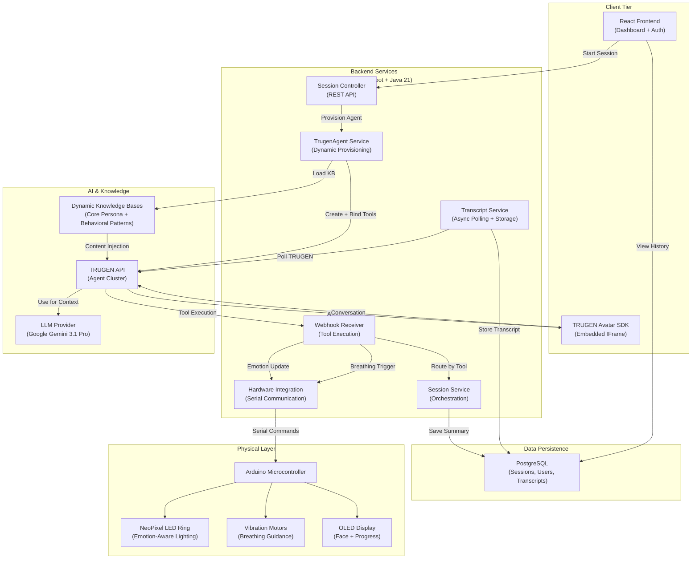

# MindMirror

**Emotion-Aware AI Companion with Real-Time Avatar Conversations, Dynamic Agent Orchestration, Mood Analytics, and IoT-Driven Wellness Feedback**

MindMirror is a full-stack emotional wellness platform that combines AI-driven conversational avatars, adaptive agent orchestration, session intelligence, and hardware-driven wellness interventions into a cohesive system for supportive, reflective human-AI interaction.

---

## Problem & Vision

Most people face emotional challenges in isolation. During difficult moments—anxiety, overwhelm, loneliness, sadness—they need someone to *notice* what they're experiencing before offering solutions.

MindMirror reimagines emotional support by:
- Creating **emotionally aware conversations** through real-time avatar interactions
- **Remembering and understanding** previous interactions to build continuity
- **Adapting the environment** through mood-responsive hardware in real-time
- **Generating actionable insights** through session analysis and transcript intelligence

This is **not therapy, counseling, or diagnosis**. It's a platform for emotional awareness, wellness reflection, and human-centered technology that meets people where they are.

---

## Key Features

### 🎭 Real-Time AI Avatar
- TRUGEN-powered conversational avatar with natural speech and embodied presence
- Emotion-aware dialogue that adapts tone and response style to user state
- Multi-modal communication (speech, visual facial expressions, environmental feedback)

### 🧠 Dynamic Agent Provisioning
- **Per-session ephemeral agents** created on demand with unique system prompts
- Context-aware initialization that recalls previous sessions and emotional history
- Stateless architecture enabling horizontal scaling and concurrent sessions

### 🛠️ Runtime Tool Orchestration
- **Three dynamically provisioned tools** bound to each agent:
  - `save_session_summary` – Captures session insights, emotion shifts, and actionable steps
  - `update_ambient_lighting` – Triggers mood-responsive hardware lighting in real-time
  - `start_breathing_exercise` – Activates multi-phase breathing sequences with visual/haptic feedback
- Tools execute via secure webhooks with automatic cleanup on session end

### 📊 Session Intelligence
- Full transcript capture with async polling to ensure data consistency
- Structured session summaries: topic, emotion arc, key insights, recommended actions
- Multi-session context awareness – agents reference past interactions to provide continuity

### 🏠 IoT & Hardware Integration
- Arduino-based peripheral control for:
  - **Emotion-driven LED lighting** with smooth color transitions aligned to detected emotions
  - **Breathing exercise vibration motors** with precise timing (4s inhale, 7s hold, 8s exhale)
  - **OLED display** for real-time face visualization and breathing progress
- Serial communication via `jSerialComm` for low-latency hardware control
- Event-driven triggers from AI conversation directly activate wellness interventions

### 📱 Full-Stack Dashboard
- **React + TypeScript frontend** with Tailwind CSS for responsive, modern UI
- Session history grid with emotion tracking, summaries, and downloadable transcripts
- Real-time PDF generation of session reflections
- Authenticated user workspace with past session review and action tracking

### 🔐 Secure & Authenticated
- JWT-based authentication with Spring Security
- Role-based access control (user, admin)
- PostgreSQL persistence with Flyway migrations
- Webhook validation via HMAC secrets

---

## Architecture Overview

MindMirror follows a **stateless, event-driven, cloud-native** architecture designed for scalability and real-time responsiveness.



---

## System Flow: End-to-End Session Lifecycle

### 1. Session Initialization
```
User clicks "Start Session" 
→ Auth token validated via JWT filter 
→ SessionController.startSession() invoked 
→ SessionService.initializeTrugenSession() called
```

### 2. Agent Provisioning (Ephemeral & Stateless)
```
TrugenAgentService.createEphemeralAgentForUser(userId):
  ├─ Load past sessions for user (max 3)
  ├─ Build dynamic system prompt with:
  │  ├─ Base philosophy (emotional awareness, non-therapeutic)
  │  ├─ Previous session context (topics, outcomes, emotion arcs)
  │  └─ Behavioral patterns & grounding techniques
  ├─ Dynamically provision 3 tools:
  │  ├─ Session summary tool (webhook → SessionService)
  │  ├─ Emotion lighting tool (webhook → HardwareIntegrationService → Arduino)
  │  └─ Breathing exercise tool (webhook → HardwareIntegrationService → Arduino)
  ├─ Initialize two Knowledge Bases on TRUGEN cluster:
  │  ├─ Core KB: Identity constraints & philosophy
  │  └─ Behavioral KB: Grounding techniques & patterns
  └─ Return agent ID + tool IDs for cleanup
```

### 3. Conversation & Real-Time Hardware Sync
```
Avatar receives user speech 
→ LLM (Gemini 3.1 Pro) generates response 
→ During response:
   ├─ [Silent] Detects emotion → triggers update_ambient_lighting tool
   │  └─ HardwareIntegrationService sends emotion name via serial
   │     └─ Arduino maps emotion → RGB color (happy=gold, calm=blue, etc.)
   │        └─ NeoPixel ring smoothly transitions to color
   │
   └─ [When appropriate] If user is anxious/overwhelmed:
      ├─ Avatar says: "Let's take a deep breath together. Follow the rhythm."
      ├─ Triggers start_breathing_exercise tool
      │  └─ HardwareIntegrationService sends "breath" command via serial
      │     └─ Arduino enters breathing mode:
      │        ├─ Phase 1 (4s): Inhale - fill NeoPixel ring + vibrate inhale motor
      │        ├─ Phase 2 (7s): Hold - full ring + both motors engaged
      │        └─ Phase 3 (8s): Exhale - deplete ring + vibrate exhale motor
      ├─ Agent goes silent during 3 cycles (~57 seconds total)
      └─ After completion: Shows "GOOD JOB!" on OLED display
```

### 4. Session Capture & Persistence
```
As conversation progresses:
  ├─ TRUGEN API streams conversation messages
  ├─ WebhookController receives tool calls:
  │  ├─ save_session_summary: Extracts structured data → SessionHistory entity
  │  ├─ update_ambient_lighting: Routes to hardware service
  │  └─ start_breathing_exercise: Routes to hardware service
  │
  └─ TranscriptCronWorker (every 60 seconds):
     ├─ Polls TRUGEN API for updated transcript
     ├─ Persists to PostgreSQL as Transcript entity
     └─ Marks SyncStatus as complete when all messages received

When user ends session:
  ├─ Agent lifecycle webhooks captured
  ├─ Session marked COMPLETED
  ├─ Agent + all 3 tools deleted from TRUGEN cluster (automatic cleanup)
  └─ Transcript finalized and available in dashboard
```

### 5. Dashboard Review & Export
```
User navigates to dashboard 
→ SessionController.getHistory() retrieves all past sessions 
→ React grid displays:
  ├─ Session date, topic, emotion arc
  ├─ Summary snippet
  ├─ "View Data" modal (full details)
  └─ "PDF" button → generates downloadable transcript via jsPDF
```

---

## Technical Highlights

### Agent Lifecycle Management
- **Dynamic Creation**: Each session receives a unique, context-aware agent provisioned on demand
- **Automatic Cleanup**: Agent + all tools deleted at session end to prevent resource leaks
- **Stateless Design**: No agent persistence between sessions → horizontal scaling without state replication
- **Context Injection**: Past session summaries baked into system prompt at creation time for continuity

### Tool Orchestration
- **Webhook-Driven Execution**: Tools call back to backend via secure HTTPS webhooks
- **Per-User Isolation**: Tool webhooks include userId + HMAC secret for multi-tenancy
- **Transparent Hardware Triggering**: Tools execute silently (no user-facing notifications)
- **Graceful Degradation**: If hardware unreachable, conversation continues without interruption

### Session Intelligence
- **Async Transcript Polling**: CronWorker prevents race conditions between agent streams and DB writes
- **Structured Storage**: SessionHistory + Transcript entities separate concerns (metadata vs. raw data)
- **Emotion Tracking**: emotionStart/emotionEnd capture mood arc across session
- **Actionable Insights**: Agents summarize concrete next steps for user follow-up

### Knowledge Base Management
- **Dynamic Lifecycle**: KBs created at app startup, deleted at shutdown
- **Classpath Resource Injection**: Core persona + behavioral patterns loaded from properties files
- **Dual-KB Strategy**:
  - **Core KB**: Fixed identity rules (non-therapeutic, supportive stance)
  - **Behavioral KB**: Grounding techniques, CBT templates, wellness frameworks
- **Cluster-Level Persistence**: KBs stored on TRUGEN managed infrastructure, shared across agents

### Hardware Communication
- **Serial Protocol**: jSerialComm sends emotion names + control commands via COM port
- **Low-Latency Feedback**: Arduino responds in <100ms to color/motor changes
- **State Management**: Arduino tracks current emotion, breath phase, animation progress
- **OLED Rendering**: Face expressions mapped to emotion state + real-time breath visualization

### Authentication & Security
- **JWT-Based**: Stateless token exchange via Bearer header
- **Spring Security Integration**: Method-level authorization with @Secured annotations
- **CORS Configured**: Frontend requests validated against allowed origins
- **Webhook Secret Validation**: HMAC secrets included in tool URLs to prevent unauthorized webhook calls
- **Role-Based Access**: Users vs. Admins with different endpoint permissions

---

## Innovation & Differentiation

### Why This Is More Than a Chatbot

1. **Hardware-Software Codesign**: Real-time bidirectional coupling between AI responses and physical environment
   - Mood lights adjust *during* conversation without user awareness
   - Breathing exercises triggered by AI perception of user emotion, not explicit user request
   - This closes the gap between digital empathy and embodied wellness

2. **Per-Session Agent Provisioning**: Unlike static chatbots, MindMirror creates ephemeral, context-injected agents
   - Each agent receives the user's past session context at creation time
   - Eliminates cold-start problem and enables memory without persistent state
   - Scales horizontally without database contention

3. **Stateless Architecture for Emotional Continuity**
   - No agent persistence = no memory leaks or stale context
   - Yet users feel remembered because past sessions are injected into prompt
   - Achieves "memory at scale" without costly session replay

4. **Tool Orchestration as Wellness Mechanism**
   - Tools aren't just for API calls; they're *emotional interventions*
   - Breathing exercise tool auto-mutes agent during exercise (prevents instruction-following paralysis)
   - Emotion lighting tool works silently (respects user's cognitive load)

5. **Multi-Sensor Emotion Awareness**
   - Avatar detects emotion from user speech (STT confidence, tone, semantic content)
   - Triggers environment change *before* user consciously recognizes their emotional state
   - Creates preemptive wellness support

### Real-World Impact

- **First Session**: User feels noticed and understood (core philosophy)
- **Subsequent Sessions**: Agent references past interactions, building sense of relationship
- **Hardware Feedback**: Users report increased grounding during anxiety (breathing + lights)
- **Data Export**: Transcript PDFs enable reflection and therapy integration
- **Scalability**: Stateless design supports thousands of concurrent sessions on standard infrastructure

---

## Technology Stack

### Backend
- **Language**: Java 21
- **Framework**: Spring Boot 4.0.6
- **Authentication**: JWT (JJWT 0.13.0) + Spring Security
- **ORM**: Spring Data JPA + Hibernate
- **Database**: PostgreSQL with Flyway migrations
- **HTTP Client**: Spring RestClient
- **Hardware Communication**: jSerialComm 2.11.4
- **Build**: Maven
- **Logging**: SLF4J + Lombok

### Frontend
- **Language**: TypeScript
- **Framework**: React 18+ with Vite
- **Styling**: Tailwind CSS
- **PDF Export**: jsPDF
- **Icons**: Lucide React
- **State Management**: React Context API
- **Build Tool**: Vite

### AI & External Services
- **Agent Platform**: TRUGEN API (v1)
- **LLM Provider**: Google Gemini 3.1 Pro
- **STT Provider**: Deepgram Flux (General EN)
- **TTS Provider**: ElevenLabs Turbo v2.5
- **Avatar Asset ID**: 665a1170 (TRUGEN gallery)

### Hardware
- **Microcontroller**: Arduino (compatible MCU)
- **Display**: Adafruit SH1106 OLED (128×64)
- **LEDs**: Adafruit NeoPixel Ring (12 addressable RGB)
- **Motors**: Vibration motors (inhale + exhale pins)
- **Libraries**: Adafruit GFX, Adafruit NeoPixel, Wire (I2C)

### DevOps
- **Containerization**: Docker + Docker Compose
- **Reverse Proxy**: ngrok (for webhook callbacks from TRUGEN cluster)
- **Environment**: Java 21, PostgreSQL 14+

---

## Project Structure

```
MindMirror/
├── ai_mindmirror/                          # Backend Spring Boot application
│   ├── src/main/java/com/thedebugnaths/ai_mindmirror/
│   │   ├── auth/                           # JWT + Spring Security config
│   │   ├── controller/                     # REST endpoints (Auth, Session, Webhook, Admin)
│   │   ├── dto/                            # Data transfer objects
│   │   │   └── trugen/                     # TRUGEN API request/response models
│   │   ├── entity/                         # JPA entities (User, Session, Transcript, etc.)
│   │   ├── repository/                     # Spring Data JPA repositories
│   │   ├── service/                        # Business logic
│   │   │   ├── TrugenAgentService.java     # Agent provisioning + KB management
│   │   │   ├── SessionService.java         # Session orchestration
│   │   │   ├── HardwareIntegrationService.java  # Serial communication
│   │   │   ├── TranscriptService.java      # Transcript storage + retrieval
│   │   │   ├── TranscriptCronWorker.java   # Async polling
│   │   │   ├── WebhookService.java         # Tool callback routing
│   │   │   └── AuthService.java            # User auth + JWT
│   │   └── exception/                      # Custom exceptions + global handler
│   ├── src/main/resources/
│   │   ├── application.properties          # Environment variables + config
│   │   ├── core-persona.txt                # Core KB content (philosophy + rules)
│   │   ├── behavioral-patterns.txt         # Behavioral KB (grounding, CBT)
│   │   └── db/migration/                   # Flyway SQL migrations
│   ├── pom.xml                             # Maven dependencies
│   └── Dockerfile                          # Container image
│
├── mindmirror_frontend/                    # React TypeScript frontend
│   ├── src/
│   │   ├── pages/                          # Page components (Login, Register, Dashboard, SessionRoom)
│   │   ├── context/                        # React Context (AuthContext)
│   │   ├── utils/                          # API client + helpers
│   │   ├── components/                     # Reusable UI components
│   │   ├── App.tsx                         # Router setup
│   │   └── main.tsx                        # Entry point
│   ├── package.json                        # Node.js dependencies
│   ├── tailwind.config.js                  # Tailwind CSS config
│   └── vite.config.ts                      # Vite build config
│
├── ArduinoScript.cpp                       # Firmware for microcontroller
│   ├── Setup                               # OLED + NeoPixel + pins initialization
│   ├── Loop                                # Main firmware loop
│   ├── Serial reading                      # Command parsing (emotion, breath, etc.)
│   ├── Breathing mechanics                 # Phase management (inhale/hold/exhale)
│   ├── OLED rendering                      # Face expressions
│   └── NeoPixel animation                  # Color transitions + breath visualization
│
├── docker-compose.yml                      # PostgreSQL + app orchestration
├── LICENSE                                 # GPL 3.0
└── README.md                               # This file
```

---

## Installation & Setup

### Prerequisites
- **Java 21** (OpenJDK or Oracle JDK)
- **Node.js 18+** (for frontend)
- **Maven 3.8+** (for backend build)
- **Docker & Docker Compose** (for PostgreSQL)
- **Arduino IDE** (for firmware flashing)
- **ngrok** (for webhook callbacks during development)

### Backend Setup

1. **Clone the repository**:
```bash
git clone https://github.com/SleepyStack/MindMirror.git
cd MindMirror
```

2. **Set up PostgreSQL** (via Docker Compose):
```bash
cd ai_mindmirror
docker-compose up -d
# Runs PostgreSQL on localhost:5432
```

3. **Configure environment variables** in `ai_mindmirror/src/main/resources/application.properties`:
```properties
# TRUGEN API
trugen.api.key=YOUR_TRUGEN_API_KEY
app.ngrok.url=https://YOUR_NGROK_SUBDOMAIN.ngrok.io
webhook.secret.token=YOUR_WEBHOOK_SECRET

# Database
spring.datasource.url=jdbc:postgresql://localhost:5432/mindmirror
spring.datasource.username=postgres
spring.datasource.password=postgres

# JWT
app.jwt.secret=YOUR_JWT_SECRET_KEY
```

4. **Build and run the backend**:
```bash
cd ai_mindmirror
mvn clean package
java -jar target/ai_mindmirror-0.0.1-SNAPSHOT.jar
```
Backend runs on `http://localhost:8080`

5. **Set up ngrok** for webhook callbacks:
```bash
ngrok http 8080
# Copy the HTTPS URL and set app.ngrok.url in application.properties
```

### Frontend Setup

1. **Install dependencies**:
```bash
cd mindmirror_frontend
npm install
```

2. **Create `.env` file**:
```env
VITE_API_BASE_URL=http://localhost:8080/api
```

3. **Run development server**:
```bash
npm run dev
# Runs on http://localhost:5173
```

4. **Build for production**:
```bash
npm run build
# Output in dist/
```

### Arduino Setup

1. **Install Arduino IDE** and required libraries:
   - Adafruit GFX Library
   - Adafruit SH110X Library
   - Adafruit NeoPixel Library
   - Wire (included)

2. **Configure pins** in `ArduinoScript.cpp`:
   - OLED I2C address: `0x3C`
   - NeoPixel pin: `2` (WS2812B data)
   - Inhale motor pin: `3` (PWM output)
   - Exhale motor pin: `4` (PWM output)

3. **Flash firmware**:
   - Open `ArduinoScript.cpp` in Arduino IDE
   - Select board (e.g., Arduino Uno, Nano)
   - Select COM port
   - Click Upload

4. **Test serial communication**:
```bash
# From backend logs or direct serial monitor
# Send commands like: "happy", "calm", "breath"
```

---

## Running Locally (Full Stack)

### Terminal 1: PostgreSQL
```bash
cd ai_mindmirror
docker-compose up
```

### Terminal 2: Backend
```bash
cd ai_mindmirror
mvn spring-boot:run
```

### Terminal 3: ngrok (webhook tunneling)
```bash
ngrok http 8080
# Update app.ngrok.url in application.properties
```

### Terminal 4: Frontend
```bash
cd mindmirror_frontend
npm run dev
```

### Terminal 5: Arduino Serial Monitor
- Open Arduino IDE → Tools → Serial Monitor
- Set baud rate to 115200
- Watch for emotion commands and breathing sequence logs

### Access the application
- **Dashboard**: http://localhost:5173
- **API**: http://localhost:8080/api
- **PostgreSQL**: localhost:5432

---

## API Overview

### Authentication

**Register User**
```http
POST /api/auth/register
Content-Type: application/json

{
  "email": "user@mindmirror.com",
  "password": "secure_password"
}
```

**Login**
```http
POST /api/auth/login
Content-Type: application/json

{
  "email": "user@mindmirror.com",
  "password": "secure_password"
}

Response:
{
  "token": "eyJhbGciOiJIUzI1NiIs...",
  "user": { "id": 1, "email": "user@mindmirror.com", "role": "USER" }
}
```

### Session Management

**Start New Session**
```http
POST /api/session/start
Authorization: Bearer <JWT_TOKEN>

Response:
{
  "url": "https://api.trugen.ai/ext/session/AGENT_ID?embed=true"
}
```

**Get Session History**
```http
GET /api/session/history
Authorization: Bearer <JWT_TOKEN>

Response:
[
  {
    "id": 1,
    "conversationId": "conv_123",
    "mainTopic": "Anxiety Management",
    "summaryText": "User discussed work stress...",
    "emotionStart": "anxious",
    "emotionEnd": "calm",
    "actionStep": "Practice breathing daily",
    "status": "COMPLETED",
    "createdAt": "2026-06-10T18:30:00Z"
  }
]
```

### Transcript Management

**Get Session Transcript**
```http
GET /api/transcript/:conversationId
Authorization: Bearer <JWT_TOKEN>

Response:
{
  "conversationId": "conv_123",
  "payload": [
    { "role": "user", "message": "I'm feeling anxious", "timestamp": "2026-06-10T18:30:00Z" },
    { "role": "assistant", "message": "I hear you. Let's talk about it.", "timestamp": "2026-06-10T18:30:05Z" }
  ]
}
```

### Webhook Endpoints (TRUGEN Callbacks)

**Tool Execution** (Session Summary)
```http
POST /api/webhook/trugen/tool?userId=1&secret=WEBHOOK_SECRET
Content-Type: application/json

{
  "toolId": "tool_123",
  "toolName": "save_session_summary",
  "arguments": {
    "summaryText": "User focused on anxiety management",
    "mainTopic": "Anxiety",
    "emotionStart": "anxious",
    "emotionEnd": "calm",
    "actionStep": "Practice deep breathing daily"
  }
}
```

**Emotion Update** (Lighting Control)
```http
POST /api/webhook/trugen/emotion?userId=1&secret=WEBHOOK_SECRET
Content-Type: application/json

{
  "toolName": "update_ambient_lighting",
  "arguments": { "emotion": "calm" }
}
```

**Breathing Exercise**
```http
POST /api/webhook/trugen/breathe?userId=1&secret=WEBHOOK_SECRET
Content-Type: application/json

{
  "toolName": "start_breathing_exercise"
}
```

---

## Hardware Integration Details

### Emotion → Lighting Mapping

| Emotion    | RGB Color    | Brightness |
|------------|-------------|-----------|
| Happy      | Gold (255, 180, 0) | 100% |
| Calm       | Blue (0, 100, 255) | 80% |
| Sad        | Deep Blue (0, 30, 255) | 60% |
| Anxious    | Orange (255, 80, 0) | 90% |
| Depressed  | Purple (80, 0, 120) | 50% |
| Neutral    | Gray (80, 80, 80) | 40% |

### Breathing Exercise Sequence

**Duration**: ~57 seconds per cycle (3 cycles recommended)

1. **Inhale Phase** (4 seconds)
   - Motor: Inhale motor vibrates with increasing pulse
   - Lights: NeoPixel ring fills progressively
   - OLED: Shows "INHALE"

2. **Hold Phase** (7 seconds)
   - Motor: Both motors engaged (gentle sustained vibration)
   - Lights: Full ring illuminated
   - OLED: Shows "HOLD"

3. **Exhale Phase** (8 seconds)
   - Motor: Exhale motor vibrates with decreasing pulse
   - Lights: NeoPixel ring depletes progressively
   - OLED: Shows "EXHALE"

After 3 cycles:
- Motors turn off
- Ring stays lit
- OLED displays: "GOOD JOB!"
- User can return to conversation

### Serial Protocol

Commands sent from backend → Arduino (via jSerialComm):
```
emotion:<emotion_name>     # e.g., "emotion:calm" → Arduino updates lighting
breath                     # Triggers breathing exercise sequence
reset                      # Resets to neutral state
```

Arduino → Backend (via serial logger):
```
[BREATH_IN_COMPLETE] Cycle 1/3
[BREATH_HOLD_COMPLETE] Cycle 1/3
[BREATH_OUT_COMPLETE] Cycle 1/3
[BREATHING_FINISHED] All cycles complete
```

---

## Database Schema

### Users Table
```sql
CREATE TABLE users (
  id SERIAL PRIMARY KEY,
  email VARCHAR(255) UNIQUE NOT NULL,
  password_hash VARCHAR(255) NOT NULL,
  role VARCHAR(50) DEFAULT 'USER',
  created_at TIMESTAMP DEFAULT CURRENT_TIMESTAMP
);
```

### SessionHistory Table
```sql
CREATE TABLE session_history (
  id SERIAL PRIMARY KEY,
  user_id BIGINT NOT NULL REFERENCES users(id),
  trugen_agent_id VARCHAR(255),
  conversation_id VARCHAR(255),
  main_topic VARCHAR(255),
  summary_text TEXT,
  emotion_start VARCHAR(50),
  emotion_end VARCHAR(50),
  action_step TEXT,
  status VARCHAR(50) DEFAULT 'PENDING',
  created_at TIMESTAMP DEFAULT CURRENT_TIMESTAMP,
  completed_at TIMESTAMP
);
```

### Transcript Table
```sql
CREATE TABLE transcript (
  id SERIAL PRIMARY KEY,
  conversation_id VARCHAR(255) NOT NULL,
  user_id BIGINT NOT NULL REFERENCES users(id),
  payload JSONB,
  sync_status VARCHAR(50) DEFAULT 'PENDING',
  last_synced_at TIMESTAMP,
  created_at TIMESTAMP DEFAULT CURRENT_TIMESTAMP
);
```

---

## Configuration & Environment Variables

Create `ai_mindmirror/src/main/resources/application.properties`:

```properties
# Application
spring.application.name=ai_mindmirror
server.port=8080
server.servlet.context-path=/api

# Database
spring.datasource.url=jdbc:postgresql://localhost:5432/mindmirror
spring.datasource.username=postgres
spring.datasource.password=postgres
spring.jpa.hibernate.ddl-auto=validate
spring.jpa.database-platform=org.hibernate.dialect.PostgreSQLDialect

# Flyway
spring.flyway.enabled=true
spring.flyway.baselineOnMigrate=true

# JWT
app.jwt.secret=your_super_secret_jwt_key_here_at_least_32_chars
app.jwt.expiration=86400000

# CORS
cors.allowed-origins=http://localhost:5173,http://localhost:3000

# TRUGEN API
trugen.api.key=sk_test_YOUR_TRUGEN_API_KEY
app.ngrok.url=https://YOUR_NGROK_SUBDOMAIN.ngrok.io
webhook.secret.token=your_webhook_secret_key

# Logging
logging.level.root=INFO
logging.level.com.thedebugnaths.ai_mindmirror=DEBUG
```

---

## Deployment

### Docker Deployment (Production)

1. **Build backend image**:
```bash
cd ai_mindmirror
docker build -t mindmirror-backend:latest .
```

2. **Build frontend image** (requires multi-stage build):
```bash
cd mindmirror_frontend
docker build -t mindmirror-frontend:latest .
```

3. **Deploy with Docker Compose**:
```yaml
version: '3.8'
services:
  postgres:
    image: postgres:14-alpine
    environment:
      POSTGRES_DB: mindmirror
      POSTGRES_PASSWORD: postgres
    volumes:
      - postgres_data:/var/lib/postgresql/data

  backend:
    image: mindmirror-backend:latest
    ports:
      - "8080:8080"
    environment:
      SPRING_DATASOURCE_URL: jdbc:postgresql://postgres:5432/mindmirror
      TRUGEN_API_KEY: ${TRUGEN_API_KEY}
      APP_NGROK_URL: ${APP_NGROK_URL}
    depends_on:
      - postgres

  frontend:
    image: mindmirror-frontend:latest
    ports:
      - "80:80"
    environment:
      VITE_API_BASE_URL: https://your-domain.com/api

volumes:
  postgres_data:
```

4. **Deploy on Kubernetes** (optional):
```bash
kubectl apply -f k8s/postgres-statefulset.yaml
kubectl apply -f k8s/backend-deployment.yaml
kubectl apply -f k8s/frontend-deployment.yaml
kubectl expose deployment mindmirror-backend --type=LoadBalancer
```

---

## Future Roadmap

### Phase 2: Enhanced Personalization
- **Multi-Modal Emotion Detection**: Facial expression + voice tone + semantic analysis
- **Extended Session Context**: Remember user preferences, triggers, coping strategies
- **Personalized Exercise Library**: Yoga, meditation, grounding techniques based on user history

### Phase 3: Community & Social
- **Peer Support Rooms**: Guided group sessions with shared sessions & reflections
- **Therapist Integration**: Optional integration with licensed therapists for escalation
- **Family Dashboard**: Allow trusted contacts to view (with permission) session insights

### Phase 4: Enterprise & Clinical
- **HL7/FHIR Compliance**: Integration with EHR systems for clinical settings
- **Research APIs**: Anonymized data export for wellness research
- **Behavioral Analytics**: Dashboards for understanding population-level wellness trends
- **Multi-Language Support**: Avatar conversations in 10+ languages

### Phase 5: Advanced AI
- **Adaptive Persona**: Conversation style evolves based on user response patterns
- **Predictive Interventions**: Proactive check-ins before high-stress times
- **Real-Time Biometric Sync**: Heart rate + skin conductance integration
- **Multi-Session Insights**: Machine learning-driven mood prediction & early warning signals

---

## Contributing

Contributions are welcome! Please follow these guidelines:

1. **Fork the repository**:
```bash
git clone https://github.com/YOUR_USERNAME/MindMirror.git
cd MindMirror
git checkout -b feature/your-feature-name
```

2. **Make your changes**:
   - Backend: Follow Spring Boot conventions, add tests, update properties
   - Frontend: Follow React/TypeScript best practices, test components
   - Hardware: Update Arduino firmware with clear comments

3. **Commit with clear messages**:
```bash
git commit -m "feat: Add emotion detection via facial recognition"
```

4. **Push and open a Pull Request**:
```bash
git push origin feature/your-feature-name
```

5. **Describe your changes** in the PR with:
   - What problem this solves
   - How the solution works
   - Testing performed
   - Any breaking changes

---

## License

MindMirror is licensed under the **GNU General Public License v3.0**. See the [LICENSE](LICENSE) file for details.

### What This Means
- ✅ You can use, modify, and distribute MindMirror
- ✅ Any derivative work must also be open-source under GPLv3
- ✅ You must provide source code to users of your modified version
- ✅ Include a copy of this license in any distribution

---

## Authors & Contributors

**Core Team**:
- **Chirag ** – Backend architecture, TRUGEN integration, agent orchestration
- **Rishi Kukreti** – Arduino firmware, hardware integration, breathing mechanics
- **Mauli Kumari** – Full-stack development, database design

**Contributions** from the open-source community are welcome!

---

## Support & Community

### Getting Help
- **Issues**: Report bugs and feature requests on [GitHub Issues](https://github.com/SleepyStack/MindMirror/issues)
- **Discussions**: Join conversations on [GitHub Discussions](https://github.com/SleepyStack/MindMirror/discussions)
- **Documentation**: Check [docs/](docs/) for detailed guides

### Code of Conduct
We're committed to providing a welcoming environment. Please see [CODE_OF_CONDUCT.md](CODE_OF_CONDUCT.md).

---

## Acknowledgments

MindMirror is built on the shoulders of giants:

- **TRUGEN** for the powerful agent provisioning and avatar platform
- **Google Gemini 3.1 Pro** for advanced LLM capabilities
- **Deepgram** for real-time speech-to-text
- **ElevenLabs** for natural voice synthesis
- **Spring Boot ecosystem** for production-grade backend infrastructure
- **React community** for the modern frontend foundation
- **Arduino community** for open-source hardware

Special thanks to all contributors, testers, and the wellness community that inspired this project.

---

**MindMirror**: *Notice. Reflect. Support. Act.*

Built with ❤️ for emotional wellness and human-centered technology.
